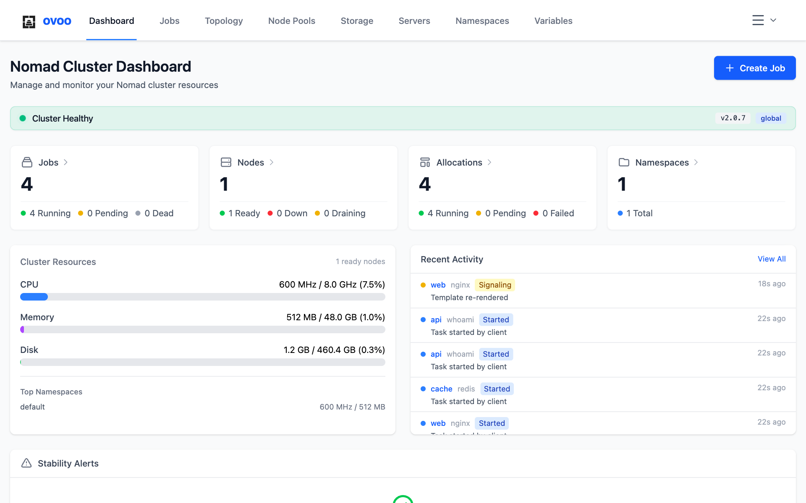
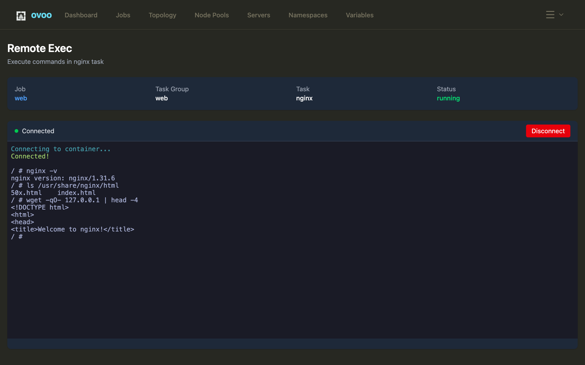

<div align="center">

<picture>
  <source media="(prefers-color-scheme: dark)" srcset="docs/images/logo-dark.png">
  
</picture>

# ovoo

**A web UI for HashiCorp Nomad that runs on Cloudflare Workers or in Docker.**
Formerly Nomad Compass.

[](https://github.com/ingvarch/ovoo/releases/latest)
[](LICENSE)



</div>

## What it does

- Shows cluster health, resource usage, stability alerts and recent activity
  on one dashboard.
- Creates, edits, clones and deletes jobs: containers, resources, environment
  variables, ports, service health checks, private registries and Traefik
  ingress tags.
- Shows the plan diff before a job is submitted, and reverts a job to any
  earlier version.
- Streams task logs with stdout/stderr filtering.
- Opens a terminal in a running task. The ACL token stays in an `httpOnly`
  cookie and never appears in a URL.
- Lists allocations, failed allocations, nodes, servers and the cluster
  topology.
- Manages ACL policies (visual or HCL editor), roles and tokens, and creates
  and deletes namespaces.
- Has light, dark and system themes.



## Quick start

With Docker, point the published image at your Nomad API:

```sh
docker run -p 3000:3000 \
  -e NOMAD_ADDR=http://your-nomad:4646 \
  -e TICKET_SECRET=$(openssl rand -hex 32) \
  ghcr.io/ingvarch/ovoo:latest
```

Open [http://localhost:3000](http://localhost:3000) and paste your ACL token.

From source, you need [Bun](https://bun.sh/) 1.2+:

```sh
git clone https://github.com/ingvarch/ovoo.git
cd ovoo
bun install
cp .dev.vars.example .dev.vars
```

In `.dev.vars`, set `NOMAD_ADDR` to your Nomad API and `TICKET_SECRET` to the
output of `openssl rand -hex 32`. Then run `bun run dev`, open
[http://localhost:5173](http://localhost:5173) and paste your ACL token.

## Documentation

- [Usage](docs/usage.md): signing in, jobs, logs, remote exec, namespaces.
- [Configuration](docs/configuration.md): environment variables, the ticket
  secret and local `.dev.vars`.
- [Deployment](docs/deployment.md): Cloudflare Workers, Docker, Compose,
  running behind a reverse proxy, release images.
- [Development](docs/development.md): dev modes, commands, project structure
  and tech stack.
- [Security](docs/security.md): cookies, CSRF, rate limits, signed WebSocket
  tickets.
- [Traefik guides](docs/traefik/): Traefik as ingress for Nomad jobs, with
  the ingress options of the job form.

## Contributing

How to build ovoo, run the checks and send a change is in
[CONTRIBUTING.md](CONTRIBUTING.md). Security problems are reported privately,
see [SECURITY.md](SECURITY.md).

## License

MIT, see [LICENSE](LICENSE).

Nomad is a trademark of HashiCorp. ovoo is an independent project and is not
affiliated with or endorsed by HashiCorp.

## About the name

An ovoo is a Mongolian cairn: a heap of stones on a hilltop or a mountain
pass. On the open steppe you see one from far away, and it tells you where
you are and which way the road goes.

A cluster is that steppe. This is the landmark you check first.
