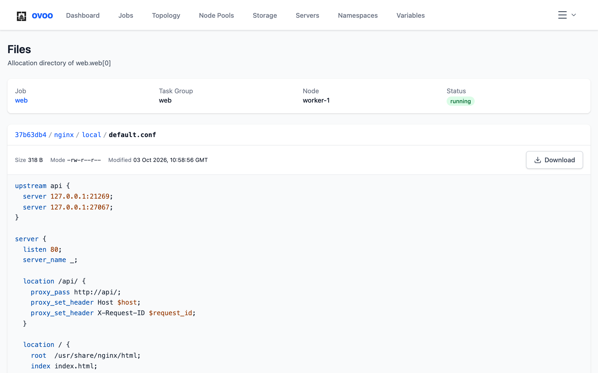
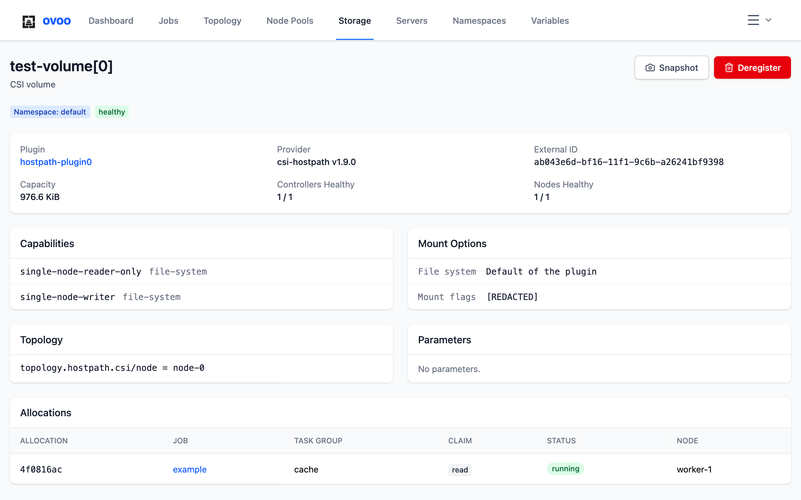

# Usage

## Signing in

Paste your Nomad ACL token on the login page. The Nomad address comes from
`NOMAD_ADDR` on the server (see [Configuration](configuration.md)). After
login the token lives in an `httpOnly` cookie, and JavaScript cannot read it
(see [Security](security.md)).

## Dashboard & cluster health

The dashboard provides a bird's-eye view of your Nomad cluster:

- **Cluster overview**: displays cluster status (Ready/Degraded), the active
  Raft leader, Raft peer count, Nomad version, total node counts, and active
  jobs.
- **Resource utilization**: visual progress bars show cluster-wide CPU (MHz) and
  memory (MB/GB) allocated versus total cluster capacity.
- **Stability alerts**: automatically identifies common cluster issues:
  - *Flapping tasks*: tasks trapped in frequent crash/restart loops.
  - *Failing allocations*: allocations terminated unexpectedly with errors.
  - *OOM kills*: containers killed by the kernel for exceeding memory limits.
  - *Unplaced allocations*: evaluations where the scheduler failed to place
    tasks due to constraint or resource mismatches.
- **Recent activity**: a real-time feed of recent job, node, and allocation
  state changes.

## Managing jobs

1. **View jobs**: the jobs page lists all jobs across all namespaces or within a
   selected namespace, with status badges, task counts, and job types.
2. **Job details**: click on a job to view its overview, task groups,
   allocations, versions, evaluations, and logs.
3. **Create jobs**: use the "Create Job" button to open the job form —
   containers, resources (CPU/memory), environment variables, ports, service
   health checks, private registries, and Traefik ingress tags are all
   configured visually. The plan diff is shown before the job is submitted.
4. **Edit and clone jobs**: edit a job through the same form, or clone it into
   a new one. Child jobs (dispatched jobs and periodic launches) have no Edit,
   Clone, or Start, and their edit page refuses them: Nomad drops `ParentID`
   when a job is registered again.
5. **Job actions**:
   - *Restart*: restarts all running allocations for the job in place.
   - *Stop & Purge*: stop a running job, with an optional "Purge" checkbox to
     immediately delete the job and its history from Nomad's state store.
6. **Versions and rollback**: the Versions tab lists every historical version
   of a job, displays the spec diff against the current version, and allows
   one-click reversion to any previous version.
7. **Canary deployments and promotion**: when a job runs a rolling update with
   canaries (`update { canary = N }`), ovoo displays an active **Deployment** card
   at the top of the Overview tab:
   - Displays deployment ID, status (running, successful, paused, failed), and target version.
   - Shows canary progress and placed allocation counts per task group.
   - **Promote Canaries**: promotes all canary allocations (or individual task groups),
     signaling Nomad that canaries are healthy to proceed with the full rolling update.
   - **Pause / Resume**: pause an in-flight deployment to inspect canaries or troubleshoot issues.
   - **Fail**: manually fail a deployment to trigger auto-revert if configured.
   - Allocations associated with canaries display a distinct purple `canary` badge on
     the Allocations page.
8. **Task group scaling**: click the **Scale** button on any non-system task group card
   in the Overview tab to open the Quick Scale dialog:
   - Adjust desired allocation count with `+` and `-` stepper buttons or direct numeric input.
   - Use quick delta buttons (`-5`, `-1`, `+1`, `+5`) and presets (`Stop All (0)` or `Reset`).
   - Displays real-time change impact (scale up vs scale down allocations, and scale-to-zero warning).
   - Enter an optional message/reason persisted in Nomad's scaling events.
   - Nomad adjusts running allocations dynamically without registering a full job specification modification.

## Periodic jobs

A periodic job is a batch job that Nomad launches on a cron schedule. Each
run is a child job, a launch, with the ID `<job>/periodic-<time>`.

1. **Create**: in the job form pick **Batch**, turn on **Run on a schedule**
   and add one or more cron expressions (`0 3 * * *`, `@daily`). With several
   expressions the job runs at the earliest match. The time zone is UTC by
   default. **Don't start a new run while the previous one is running** is on
   by default: Nomad then skips a launch while the previous run is still
   running. **Plan** shows the next launch and says that Nomad creates
   allocations at each launch. If Nomad rejects a cron expression or a time
   zone, ovoo shows Nomad's error message. For a batch job the form hides
   service discovery and the health check, unless the job already has them.
2. **Command and arguments**: **Command** on a task replaces the image `CMD`;
   the image `ENTRYPOINT` still runs. In **Arguments**, put one argument per
   row, without shell quoting. Nomad replaces `${...}` references in them.
3. **Job page**: the Schedule card shows the cron expressions, the time zone,
   the overlap setting, the state (Active, Paused or Stopped) and the next
   and last launch, and updates both on its own after each launch.
   **Run now** starts a launch right away; it works only while the schedule
   is active. **Pause** and **Resume** turn the schedule off and on. Each one
   creates a new job version, which the Versions tab shows and can revert.
   Both are disabled while the job is stopped. A periodic job has no
   allocations of its own, so its page has the Overview, Launches, Versions
   and Evaluations tabs. Logs and exec are on the launch pages.
4. **Launches**: the Launches tab lists the launches newest first, with their
   status and allocation counts. A launch page links back to its job and has
   no Edit, Clone or Start. The jobs list hides launches and marks periodic
   jobs with a `periodic` badge. The job counts on the Dashboard and the
   Namespaces page skip launches. Nomad removes finished launches during
   garbage collection (`job_gc_threshold`, 4 hours by default).

Nomad does not allow changing the job type or turning the schedule on or off
for an existing job, so the edit form locks both. A clone of a periodic job
starts with an active schedule. The form makes service and batch jobs, so a
clone of a sysbatch or system job creates a service job; for a periodic
sysbatch job Nomad rejects that clone.

## Parameterized jobs

A parameterized job runs only when someone dispatches it. Each dispatch is a
child job with the ID `<job>/dispatch-<time>-<id>`.

1. **Dispatch**: on the job page, **Dispatch** opens a form with one field per
   meta key the job lists in `meta_required` and `meta_optional`. Nomad
   rejects any other key, so the form has no free key field. An empty
   optional field keeps the value the job has for the key, which the field
   shows as its placeholder.
2. **Payload**: type the payload or attach a file, up to 16 KiB. Nomad writes
   it to the file set by `dispatch_payload` in the task. The form hides the
   payload when the job has `payload = "forbidden"` and asks for it when the
   job has `payload = "required"`.
   **Advanced** sets the priority of the dispatched job (empty keeps the
   priority of the job; Nomad accepts 1 to `job_max_priority`, 100 by default)
   and an idempotency token. A second dispatch with a token Nomad has seen
   returns the job it dispatched then, and the form says so.
3. **Result**: after the dispatch the form shows the ID of the new job and
   **Open Job** goes to its page. Dispatching needs the `dispatch-job`
   capability. Nomad rejects a dispatch of a stopped job, so the button is
   disabled until the job is started. A dispatched job links back to its job
   and has no Dispatch button.
4. **Dispatches**: a parameterized job has no allocations of its own, so its
   page has the Overview, Dispatches, Versions and Evaluations tabs. The
   Dispatches tab lists the dispatched jobs newest first, with their status
   and allocation counts, and shows a new one right after a dispatch. Nomad
   removes finished dispatched jobs during garbage collection
   (`job_gc_threshold`, 4 hours by default).

## Viewing logs

Job detail and allocation pages include a logs viewer:

- Select specific allocations and tasks.
- Switch between `stdout` and `stderr` streams.
- Auto-refresh logs at regular intervals or trigger a manual refresh.
- Monospace output with full dark/light theme contrast.

## Remote exec

From any running allocation, open an interactive terminal into a task
container:

- Runs over a WebSocket relay: the browser never contacts Nomad directly, and
  the ACL token stays safe in an `httpOnly` cookie.
- Authorized through short-lived HMAC-signed tickets (see [Security](security.md)).
- On mobile devices, an accessory bar provides essential keys (`ESC`, `TAB`,
  `Ctrl+C`, `Ctrl+D`, arrows, and clear) and adjusts to the on-screen keyboard.

## Allocations & failure analysis

- **All allocations**: view and filter allocations across all jobs, nodes, and
  namespaces by status (Running, Pending, Complete, Failed).
- **Failed allocations**: a dedicated triage page (`/allocations/failed`) that
  classifies errors:
  - Non-zero exit codes.
  - Out-of-memory (OOM) container terminations.
  - Task startup/driver failures.
  - Lost nodes and network partition disconnects.
  - Placement failures caused by exhausted node resources.
- **Quick exec**: launch a remote terminal directly from any allocation row
  or card without navigating to the job details first.
- **Allocation actions**: the actions menu of an allocation on the Allocations
  page, the Failed Allocations page and the Allocations tab of a job. The menu
  shows only what Nomad accepts for the allocation's status:
  - *Restart Allocation* (running): restarts all running tasks or one task in
    place, on the same node.
  - *Send Signal* (running): sends a POSIX signal such as `SIGHUP` or `SIGUSR1`
    to one task.
  - *Browse Files* (running, complete, failed): opens the files of the
    allocation, see below.
  - *Stop Allocation* (running, pending): stops the allocation after a
    confirmation, with an optional "No shutdown delay". Nomad then schedules a
    replacement, which may land on another node. This is how an allocation is
    moved: Nomad has no separate reschedule call for a live allocation.
  - *Reschedule Failed Allocations* (failed): asks Nomad to place the failed
    allocations of the job again now, including the ones past their reschedule
    limit. It applies to the whole job, like `nomad job eval -force-reschedule`,
    and the scheduler still decides: it places nothing for a job whose
    deployment failed.
  Restart, signal and stop need the `alloc-lifecycle` capability; rescheduling
  needs `submit-job`.
- **Files**: the allocation directory, also after the allocation finished or
  failed, until Nomad collects it as garbage. It holds the shared `alloc/`
  directory with the task logs in `alloc/logs/`, and one directory per task
  with `local/`, `tmp/` and the rendered templates. The breadcrumbs lead back
  up. A file opens with its size, mode and modification time, and **Download**
  saves the whole file. JSON, YAML, INI and TOML, nginx, shell, properties and
  XML files are highlighted. The page shows the first 512 KiB of a larger file
  and offers a binary file only as a download. Nomad never lets anyone read
  the `secrets/` directory of a task, and the page does not open log pipes or
  other files that are not regular files. Browsing needs the `read-fs`
  capability.

  

## Cluster topology

The Topology page (`/topology`) renders a structural map of the cluster:

- Grouped by Datacenter.
- Displays each client node with its status, IP, role, and allocation counts.
- Shows real-time CPU and memory allocation percentage bars per node.
- Expandable node cards reveal running tasks and allow direct navigation to
  jobs and allocations.

## Nodes & node maintenance

The Nodes page (`/nodes`) and node detail pages provide node administration:

- **Node information**: lists hostname, IP address, datacenter, Nomad version,
  OS, kernel release, and active task drivers (Docker, exec, etc.).
- **Drain mode**: gracefully drain allocations from a node prior to reboots or
  upgrades via the **Drain Node** action. Choose a deadline preset (`No deadline`,
  `15m`, `1h`, `4h`, or custom duration) and toggle whether to preserve system jobs.
  Active drains can be stopped anytime with **Cancel Drain**.
- **Scheduling eligibility**: toggle a node between `eligible` and `ineligible`
  via **Make Ineligible** / **Make Eligible** to prevent new tasks from being scheduled
  on it without disturbing existing workloads.
- **Node purge**: permanently remove dead, decommissioned nodes from cluster state with
  the **Purge Node** action.
- **Resource breakdown**: inspect allocated vs. total CPU, memory, and disk
  capacity for individual nodes.

## Node pools

Node pools (Nomad 1.6+ and 2.0+) partition client nodes into distinct
scheduling pools for targeted workloads:

- **Pool administration**: the Node Pools page (`/node-pools`) lists all
  configured pools with their scheduler algorithm (`spread` or `binpack`),
  metadata tags, and assigned node counts.
- **Create and edit pools**: create custom node pools specifying the name,
  description, placement algorithm (`spread` to distribute allocations across
  nodes or `binpack` to pack densely), and custom metadata key/value pairs.
- **Inspect pool nodes**: view detailed pool configuration and the list of
  client nodes currently running in each pool with their status and resources.
- **Node integration**: the Nodes page (`/nodes`) displays the node pool badge
  for each node and allows direct navigation to Node Pools management.

## Storage (CSI volumes)

The Storage page (`/storage`) lists the CSI volumes of all namespaces and the
CSI plugins that serve them.

- **Volumes**: each volume with its namespace, plugin, access mode, the number
  of allocations that read or write it, and its health. A volume is
  *degraded* when some of its plugin controllers or nodes are unhealthy, and
  *unschedulable* when Nomad cannot place new claims on it.
- **Volume details**: capacity, provider, external ID, capabilities, mount
  options, topology, parameters, and the allocations that use the
  volume with their claim (read or write). Nomad hides the mount flags and
  secrets, so the page shows them as `[REDACTED]`.
- **Register Volume**: registers a volume that already exists at the storage
  provider, like `nomad volume register`. The form takes the volume ID, name,
  namespace, plugin, external ID, one or more capabilities (access and
  attachment mode), file system, mount flags and parameters. There is no HCL
  editor: Nomad's API takes JSON only.
- **Deregister**: removes a volume from Nomad; the data at the provider stays.
  Nomad refuses while an allocation uses the volume. *Force* drops the claims
  of finished allocations right away, but Nomad still refuses while a running
  allocation uses the volume.
- **Snapshot**: takes a snapshot of a volume with the name you give and shows
  its ID, size and readiness. The button appears only when the controller of
  the plugin supports snapshots.
- **Plugins**: each plugin with its provider, healthy and expected controllers
  and nodes. The plugin page lists the controller features (create and delete
  volumes, snapshots, expansion) and every running controller and node
  instance with its node, health and allocation.

Listing volumes needs the `csi-list-volume` capability and the details need
`csi-read-volume`. Registering, deregistering and snapshots need
`csi-write-volume`; registering and snapshots also need `plugin` read.
Listing plugins needs `plugin` list, a plugin page needs `plugin` read.

The page does not create or delete volumes at the provider, detach them from
nodes, list snapshots or manage dynamic host volumes.

## Servers & Raft consensus

The Servers page (`/servers`) monitors the Nomad control plane:

- **Server agents**: lists all Nomad server instances, protocol version, IP
  address, and voting membership status.
- **Raft leader**: highlights the current cluster leader.
- **Autopilot health**: displays Autopilot status, overall consensus health,
  failure tolerance (how many servers can fail without losing quorum), and
  cluster redundancy.

## Activity log

The Activity page (`/activity`) serves as an audit trail for cluster events:

- Filter events by category (Jobs, Allocations, Nodes, Evaluations) and
  namespace.
- Inspect scheduler evaluation results, placement decisions, and reasons why
  nodes were considered or disqualified during placement.

## Namespaces

The namespace switcher in the top navigation lists every namespace your token
is permitted to access. Job lists, allocations, and detail views filter by the
active namespace.

- The job form defaults to `default`; you can switch target namespaces inside
  the form.
- The Namespaces page (`/namespaces`) lists all namespaces, showing active job
  counts, and allows creating and deleting namespaces.

## Variables & secrets

The Variables & Secrets interface (`/variables`) provides access to Nomad's
encrypted key/value configuration store:

- **Filter & search**: filter variables by target namespace or find configuration
  paths instantly with real-time path search.
- **Masked value inspection**: values remain hidden behind password masks by
  default. Inspect individual items with a show/hide toggle, copy values directly
  to clipboard, or reveal all items with a single click.
- **Form & JSON editors**: create and update variables using an intuitive
  key-value editor (with masked secret inputs) or switch to a raw JSON editor
  for bulk editing and pasting configuration payloads.
- **Safe deletion**: confirmation dialog prevents accidental deletion of
  workload configuration.

## Access control (ACL)

The ACL management interface (`/acl`) provides tools for securing your
cluster (requires management token permissions):

- **Visual policy editor**: construct Nomad HCL policies with an intuitive
  point-and-click interface. Select granular permissions across namespaces,
  host volumes, CSI plugins, agents, and operator controls.
- **HCL policy editor**: write and edit raw Nomad HCL policies directly, with
  instant syntax validation.
- **Roles**: group multiple policies into reusable ACL roles for consistent
  role-based access management.
- **Tokens**: create Client or Management tokens, assign policies and roles,
  configure TTL expiration, view the secret ID upon generation, and revoke
  compromised or obsolete tokens.
- **Bootstrap support**: detects unbootstrapped ACL systems and guides initial
  setup.

## Mobile & Progressive Web App (PWA)

ovoo is designed mobile-first and can be installed as a Progressive Web App:

- **Installation**: Tap the **Install** banner on Chromium/Android browsers, or
  use **Share** → **Add to Home Screen** on iOS Safari. Once installed, ovoo
  runs in full-screen standalone mode without browser chrome.
- **Mobile navigation**: Quickly navigate between Dashboard, Jobs, Topology,
  and Activity via the fixed bottom navigation bar. Additional links and settings
  are accessed through the "More" bottom sheet.
- **Adaptive card views**: Data tables automatically switch to touch-optimized
  cards on smaller viewports, with swipeable tab bars and floating action buttons.
- **Mobile remote terminal**: The web terminal provides an accessory bar with
  common mobile keys (`ESC`, `TAB`, `Ctrl+C`, `Ctrl+D`, arrows, and clear) and
  dynamically responds to the virtual keyboard viewport.
